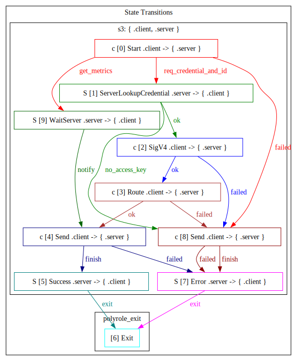

# z3

S3-compatible storage of Zig.

> Thanks to the [zs3](https://github.com/Lulzx/zs3) project — some code and documentation originates from it.

## Supported capabilities
- Full AWS SigV4 authentication (works with aws-cli, boto3, any SDK)
- PUT, GET, DELETE, HEAD, LIST (v2)
- HeadBucket for bucket existence checks
- DeleteObjects batch operation
- Multipart uploads for large files
- Range requests for streaming/seeking (RFC 7233 compliant suffix ranges)
- HTTP 100-continue support (boto3 compatible)

## Capabilities under development
- Versioning, lifecycle policies, bucket ACLs
- Pre-signed URLs, object tagging, encryption

## Quick Start

```bash
zig build -Doptimize=ReleaseFast
./zig-out/bin/z3
```

Server listens on port 9000, stores data in `./data`. Default credentials are
`minioadmin:minioadmin` (admin role) — **do not use in production**.

### Credentials & roles

Provide credentials at runtime (`--acl=`):

```bash
./zig-out/bin/z3 --acl="admin:akey:asec,reader:rkey:rsec,writer:wkey:wsec"
```

Format: `role:access_key:secret_key`, comma-separated. Roles:

| Role   | Allowed methods                              |
|--------|----------------------------------------------|
| admin  | all                                          |
| writer | GET, HEAD, OPTIONS, PUT, POST, DELETE        |
| reader | GET, HEAD, OPTIONS                           |

Other useful flags: `--port=PORT`, `--data-dir=PATH`, `--tmp=PATH` `--help`.


## Usage

```bash
export AWS_ACCESS_KEY_ID=minioadmin
export AWS_SECRET_ACCESS_KEY=minioadmin

aws --endpoint-url http://localhost:9000 s3 mb s3://mybucket
aws --endpoint-url http://localhost:9000 s3 cp file.txt s3://mybucket/
aws --endpoint-url http://localhost:9000 s3 ls s3://mybucket/ --recursive
aws --endpoint-url http://localhost:9000 s3 cp s3://mybucket/file.txt ./
aws --endpoint-url http://localhost:9000 s3 rm s3://mybucket/file.txt
```

Works with any S3 SDK:

```python
import boto3

s3 = boto3.client('s3',
    endpoint_url='http://localhost:9000',
    aws_access_key_id='minioadmin',
    aws_secret_access_key='minioadmin'
)

s3.create_bucket(Bucket='test')
s3.put_object(Bucket='test', Key='hello.txt', Body=b'world')
print(s3.get_object(Bucket='test', Key='hello.txt')['Body'].read())
```

## The interesting bits

**SigV4 is elegant.** The whole auth flow is ~150 lines. AWS's "complex" signature scheme is really just: canonical request -> string to sign -> HMAC chain -> compare. No magic.

**Storage is just files.** `mybucket/folder/file.txt` is literally `./data/mybucket/folder/file.txt`. You can `ls` your buckets. You can `cp` files in. It just works.

**Zig makes this easy.** No runtime, no GC, no hidden allocations, no surprise dependencies. 

## Design

Every S3 request is split into two halves, **A** and **B**:

- **A (Server):** lightweight operations that need consistency guarantees — access key
  lookups, global counter increments, metrics updates, log writes. All of **A runs
  sequentially** in a single thread.
- **B (Client):** heavy disk I/O and CPU work — HTTP header parsing, SigV4 HMAC
  computation, file reads/writes, request routing, response serialization. All of
  **B runs concurrently** across a pool of zio coroutines.

Under load this forms a "set of A" and a "set of B". Serializing A and parallelising
B yields the best throughput.

To achieve this, [polyrole](https://github.com/sdzx-1/polyrole) describes the full lifecycle of an S3 request as a typed
state machine. The A set executes in one OS thread; the B set executes across [zio](https://github.com/lalinsky/zio)'s
coroutine pool.

**Communication between A and B:**
- B → A: a bounded `MsgChannel` queue (capacity 1000)
- A → B: a `WaitMsg` struct written directly into B's `ClientContext`, signalled
  via `ResetEvent`

The full A–B protocol is the state machine visualised:



This pattern mirrors the **Erlang client-server model**: the server (A) is passive,
the client (B) sends messages and waits for replies.

**Pointer-based communication.** A and B pass `*ClientContext` pointers, so the
per-message cost is essentially one `ResetEvent` syscall — no copies, no
serialisation. Polyrole guarantees at compile-time that A never accesses B's
pointer after B has exited, making this safe without runtime checks.

> The bulk of the B-side code is derived from [zs3](https://github.com/Lulzx/zs3).

## When to use this

- Local dev (replacing localstack/minio)
- CI artifact storage
- Self-hosted backups
- Embedded/appliance storage
- Learning how S3 actually works
- Learning polyrole

## When NOT to use this

- Production with untrusted users
- Anything requiring durability guarantees beyond "it's on your disk"
- If you need any feature in the "not supported" list

## Building

Requires Zig 0.16.

```bash
zig build                                    # debug
zig build -Doptimize=ReleaseFast             # release
zig build -Dtarget=x86_64-linux-musl         # cross-compile
```

## Testing

```bash
python3 test_client.py          # 24/24 integration tests (stdlib only)
python3 test_comprehensive.py   # 66/66 boto3 tests (standalone)
```

Requires `pip install boto3` for comprehensive tests.

## Benchmark

## Limits

| Limit | Value |
|-------|-------|
| Max header size | 8 KB |
| Max body size | 5 GB |
| Max key length | 1024 bytes |
| Bucket name | 3-63 chars |

## Security

- Full SigV4 signature verification (case-insensitive header matching)
- Input validation on bucket names, object keys, and upload IDs
- Path traversal protection (blocks `..` in keys, rejects absolute paths, validates multipart upload IDs)
- XML escaping on all user-supplied values in responses (keys, prefixes, continuation tokens, max-keys)
- Query parameter boundary checking (no substring false positives)
- Request size limits (8KB headers, 5GB body, 1024-byte keys)
- No shell commands, no eval, no external network calls

TLS not included. Use a reverse proxy (nginx, caddy) for HTTPS.

## api document
[api](api.md)
